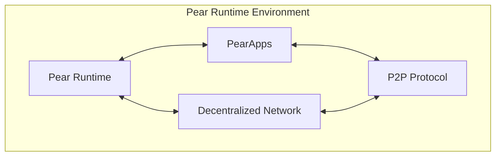
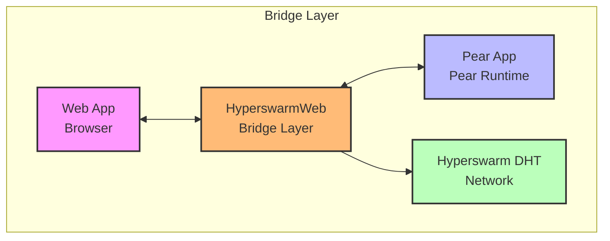
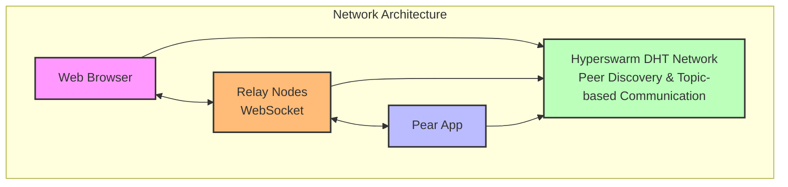
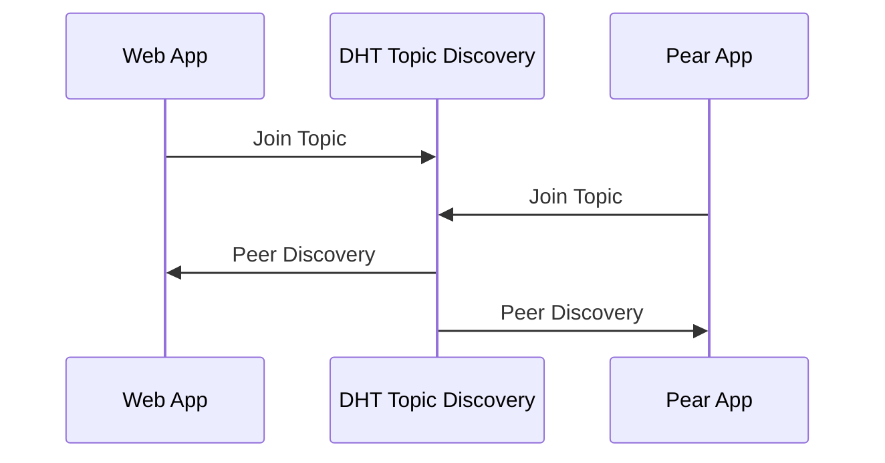
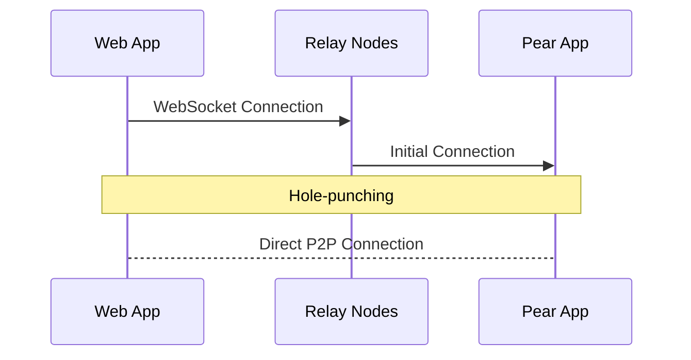

# HyperswarmWeb

HyperswarmWeb is a specialized TypeScript library that enables seamless peer-to-peer (P2P) connectivity between web applications and Pear Runtime apps. It bridges the gap between browser environments and the decentralized network provided by the Hyperswarm Distributed Hash Table (DHT), facilitating direct P2P communication across different platforms.

## Table of Contents
- [Features](#features)
- [Introduction to Pear Runtime](#introduction-to-pear-runtime)
- [How HyperswarmWeb Works](#how-hyperswarmweb-works)
- [Architecture](#architecture)
- [Installation](#installation)
- [Usage](#usage)
- [Web Application Example](#web-application-example)
- [Pear Runtime Application Example](#pear-runtime-application-example)
- [Advanced Usage](#advanced-usage)
- [API Documentation](#api-documentation)
- [Security Considerations](#security-considerations)
- [Real-World Use Cases](#real-world-use-cases)
- [Performance and Scalability](#performance-and-scalability)
- [Error Handling and Troubleshooting](#error-handling-and-troubleshooting)
- [Testing and Debugging](#testing-and-debugging)
- [Compatibility Notes](#compatibility-notes)
- [Contributing](#contributing)
- [License](#license)

## Features
- **Seamless Web-to-Pear Runtime Connectivity**: Enables direct P2P connections between web browsers and Pear apps.
- **Decentralized Peer Discovery**: Utilizes the Hyperswarm DHT for efficient and decentralized peer discovery.
- **Cross-Runtime Communication**: Facilitates communication across web browsers and Node.js/Pear runtime environments.
- **Relay Nodes for Initial Connections**: Overcomes browser networking limitations using relay nodes and hole-punching.
- **Event-Driven Architecture**: Provides a simple API with events for connections, data, and peer updates.
- **TypeScript Support**: Written in TypeScript, offering type safety and ES Module syntax.
- **End-to-End Encryption**: Secure communication using the Noise protocol.
- **Scalable and Efficient**: Designed to handle multiple peer connections with optimal performance.

## Introduction to Pear Runtime



The Pear Runtime is a decentralized application platform that allows developers to build and run peer-to-peer applications without relying on centralized servers. PearApps are applications designed to operate within this environment, leveraging the decentralized network for communication and data sharing.

Pear Runtime provides:
- **Decentralization**: Eliminates the need for central servers.
- **Scalability**: Handles a growing number of peers efficiently.
- **Security**: Ensures secure communication between peers.
- **Interoperability**: Allows integration with various platforms and technologies.

## How HyperswarmWeb Works



HyperswarmWeb bridges web applications and Pear runtime apps by leveraging the same underlying Hyperswarm protocol used in Pear applications.

### Key Differences
While HyperswarmWeb shares much of its functionality with the standard Hyperswarm library, it introduces specific mechanisms to overcome browser networking limitations:

- **Relay Nodes and Hole-Punching**: Uses WebSocket relay nodes to facilitate initial connections and perform NAT traversal (hole-punching) to establish direct P2P connections.
- **Browser Compatibility**: Adapts Hyperswarm functionalities to work within browser environments that lack raw TCP/UDP socket access.

## Architecture



### Network Flow
1. **Topic Announcement and Discovery**


2. **Connection Establishment**


## Installation

```bash
npm install hyperswarm-web
```
Note: Ensure that your project supports ES Modules and TypeScript.

## Usage

### Web Application Example
```typescript
import HyperswarmWeb from 'hyperswarm-web';
import crypto from 'crypto';

// Create a new HyperswarmWeb instance
const swarm = new HyperswarmWeb({
  maxPeers: 24,
  bootstrap: ['wss://relay1.hyperswarm.org', 'wss://relay2.hyperswarm.org'],
});

// Generate a 32-byte topic using SHA-256 hash
const topic = crypto.createHash('sha256').update('my-pear-app-name').digest();

// Join the topic for peer discovery
await swarm.join(topic, { announce: true, lookup: true });

// Listen for incoming connections
swarm.on('connection', (connection, info) => {
  console.log('Connected to peer:', info);

  // Send data to the peer
  connection.write('Hello from Web App');

  // Handle incoming data
  connection.on('data', (data) => {
    console.log('Received from peer:', data.toString());
  });

  // Handle connection close
  connection.on('close', () => {
    console.log('Connection closed');
  });

  // Handle errors
  connection.on('error', (err) => {
    console.error('Connection error:', err);
  });
});
```

### Pear Runtime Application Example
```typescript
import Hyperswarm from 'hyperswarm';
import crypto from 'crypto';

// Create a new Hyperswarm instance
const swarm = new Hyperswarm();

// Generate the same 32-byte topic
const topic = crypto.createHash('sha256').update('my-pear-app-name').digest();

// Join the topic
await swarm.join(topic, { announce: true, lookup: true });

// Listen for incoming connections
swarm.on('connection', (connection, info) => {
  console.log('Connected to peer:', info);

  // Send data to the peer
  connection.write('Hello from Pear App');

  // Handle incoming data
  connection.on('data', (data) => {
    console.log('Received from peer:', data.toString());
  });

  // Handle connection close
  connection.on('close', () => {
    console.log('Connection closed');
  });

  // Handle errors
  connection.on('error', (err) => {
    console.error('Connection error:', err);
  });
});
```

## API Documentation

HyperswarmWeb's API closely mirrors that of the standard Hyperswarm library, with adaptations for browser environments.

### Constructor Options
```typescript
new HyperswarmWeb(options?: HyperswarmWebOptions)
```

Parameters:
- `options` (optional):
  - `maxPeers?: number` - Maximum number of peers (default: 24)
  - `bootstrap?: string[]` - Array of WebSocket relay URLs

### Events
- `'connection'`: Emitted when a new peer connection is established
- Other events are similar to those in Hyperswarm

## Security Considerations
HyperswarmWeb provides secure communication between peers using end-to-end encryption based on the Noise protocol framework, similar to Hyperswarm.

## Real-World Use Cases
- Decentralized Chat Applications
- Collaborative Tools
- Distributed File Sharing

## Performance and Scalability
HyperswarmWeb is designed for optimal performance and scalability in browser environments. Performance considerations are similar to those in Hyperswarm, with additional attention to browser limitations.

## Error Handling and Troubleshooting
Enable Debug Logging:
```bash
DEBUG=hyperswarm* node your-app.js
```

## Testing and Debugging
- Attach Error Listeners: Always attach 'error' event listeners to catch and handle exceptions.

## Compatibility Notes
- Node.js Version: Requires Node.js >=16.0.0 for ES Module support
- TypeScript Support: Fully typed with TypeScript definitions
- Browser Requirements:
  - Supports modern browsers with WebSocket capabilities
  - Compatible with mobile browsers that support WebRTC

## Contributing
We welcome contributions from the community!

Development Setup:
```bash
git clone https://github.com/hyperswarm/hyperswarm-web.git
npm install
npm test
```

## License
This project is licensed under the terms of the MIT license. See the LICENSE file for details.
